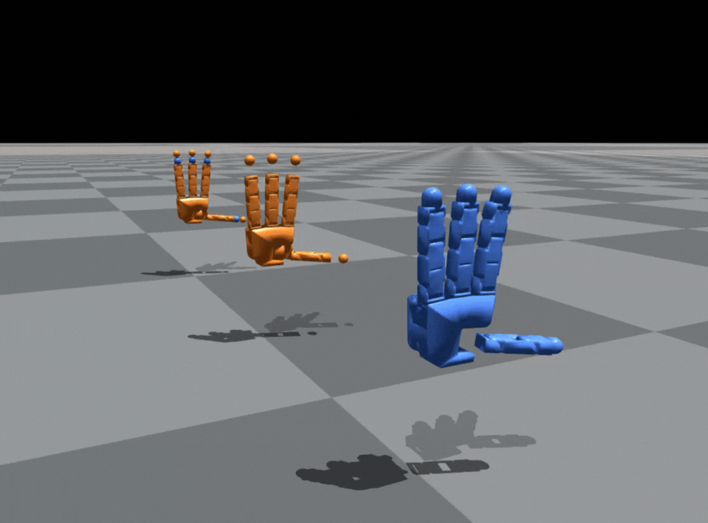
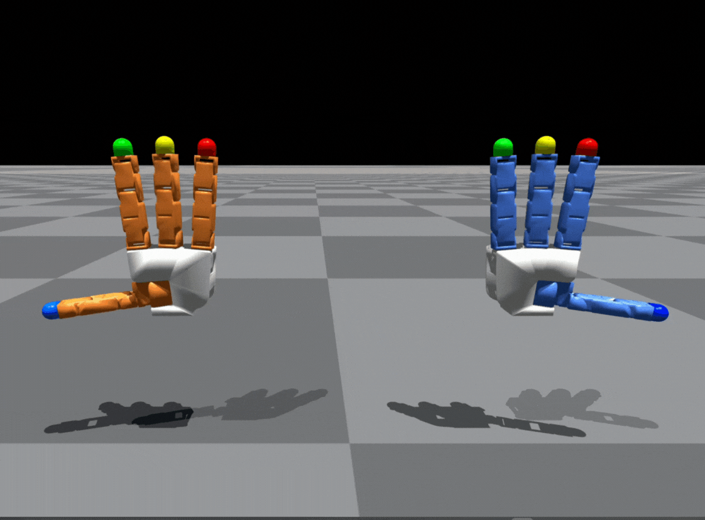
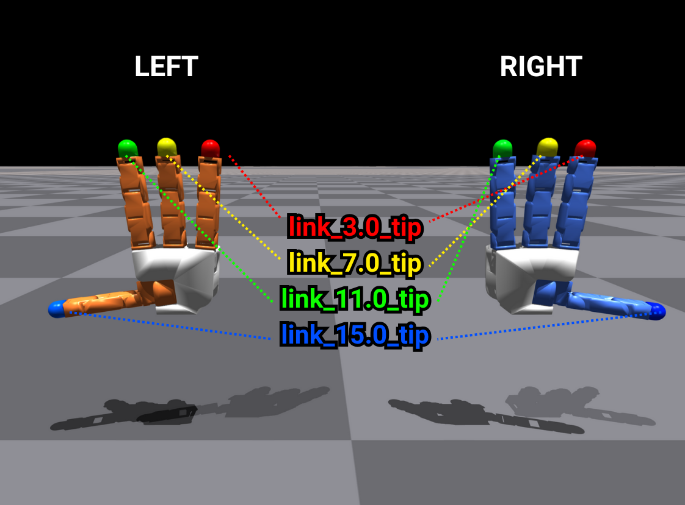
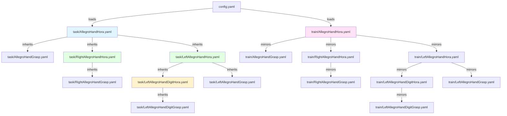
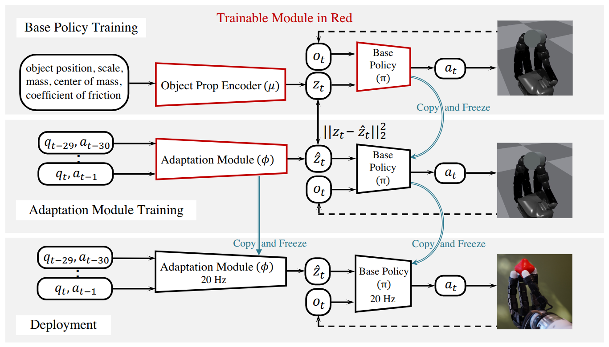

# allegro_inhand_rotation

[한국어](README.md) | [English](README.es.md)

Allegro Hand 플랫폼을 위한 손 안 물체 회전(In-Hand Object Rotation) 참조 구현

이 저장소는 **Allegro Hand 플랫폼**을 이용한 손 안 물체 회전(in-hand object rotation) 구현 예제를 제공합니다.
ROS2 기반의 하드웨어 컨트롤러와, 원래 손 안 회전 연구를 위해 개발되어 **Isaac Lab**에서 학습 및 시뮬레이션된 AI 기반 조작 알고리즘을 결합합니다.

이 구현은 현재 **Allegro Hand V4** — 표준형 손과 **DIGIT 촉각 손가락 끝을 장착한 왼손 변형** — 를 지원하지만, 소프트웨어 아키텍처는 모듈식으로 확장 가능하도록 설계되었습니다.
사내에서 추가 로봇 손 플랫폼이 개발됨에 따라, 이 코드베이스는 새로운 하드웨어 버전을 위한 **플러그인 모듈 및 어댑터**를 포함하도록 확장될 수 있으며, 이를 통해 향후 Wonik Robotics 손 시스템 전반에 걸쳐 더 폭넓은 호환성을 지원할 수 있습니다.

이 코드베이스는 다음을 활용합니다:

- **Allegro Hand ROS2 컨트롤러**
  https://github.com/Wonikrobotics-git/allegro_hand_ros2
- **AI 알고리즘: Rapid Motor Adaptation(RMA)을 통한 손 안 물체 회전**
  Haozhi Qi의 원본 연구 및 구현
  https://haozhi.io/hora/
- **시뮬레이션: Isaac Lab**
  https://isaac-sim.github.io/IsaacLab/

이 프로젝트는 [Wonikrobotics-git/allegro_inhand_rotation](https://github.com/Wonikrobotics-git/allegro_inhand_rotation)에서 포크되었습니다. 이 기반 위에 시뮬레이션 백엔드를 IsaacGym에서 Isaac Lab으로 이식하였고, DIGIT 촉각 손가락 끝 왼손 변형을 추가했으며, 학습된 정책으로부터 합성 촉각 데이터셋을 수집하는 도구를 추가했습니다. 전체 서드파티 저작권 표시는 [라이선스](#license) 섹션을 참고하세요.

## 테스트 시스템 구성

- Ubuntu 22.04
- ROS2 Humble
- Allegro Hand V4 (표준형 또는 DIGIT 촉각 손가락 끝 변형)
- Isaac Lab (2.3.2 버전에서 테스트됨)

## 시스템 요구 사항

### 1. Isaac Lab 설치

공식 설치 가이드를 따르세요: [https://isaac-sim.github.io/IsaacLab/main/source/setup/installation/index.html](https://isaac-sim.github.io/IsaacLab/main/source/setup/installation/index.html)

Isaac Lab은 Isaac Sim을 함께 제공하며, 다음과 같이 자체 Python(3.10+) 환경을 설정해줍니다:

```bash
cd /path/to/IsaacLab
./isaaclab.sh --conda        # 기본적으로 conda 환경 `env_isaaclab`을 생성합니다
conda activate env_isaaclab
```

### 2. Allegro Hand ROS2 컨트롤러

이 프로젝트는 공식 컨트롤러를 기반으로 동작합니다:

**👉 [WonikRobotics-git/allegro_hand_ros2](https://github.com/WonikRobotics-git/allegro_hand_ros2)**

자세한 설치 및 설정 방법은 공식 저장소를 참고하세요. 실제 하드웨어 배포를 위해서는 이 컨트롤러가 필요합니다.

### 3. Python 환경 설정

무거운 Isaac Lab/Isaac Sim 스택과 ROS 2 스택을 분리하기 위해 두 개의 환경을 사용합니다:

#### 환경 1: `env_isaaclab` (Isaac Lab 학습용)

```bash
# 위에서 `./isaaclab.sh --conda`로 생성됨
conda activate env_isaaclab

# Isaac Lab 위에 이 저장소의 학습 의존성을 설치
pip install -r hora_isaaclab_requirements.txt
```

**다음 작업에 이 환경을 사용하세요:**
- 시뮬레이션에서 정책 학습 (`train.py`)
- 그랩(grasp) 포즈 생성 (`gen_grasp.py`)
- 손 URDF 시각화/비교 (`allegro_right_left.py`, `compare_hands.py`)
- 합성 촉각 데이터셋 수집 (`scripts/collect_feelsight_dataset.sh`)

#### 환경 2: `allegro` (실제 배포용)

```bash
# Python 3.10으로 환경 생성
conda create -n allegro python=3.10

# 환경 활성화
conda activate allegro

# 배포 의존성 설치
pip install -r allegro_requirements.txt
```

**다음 작업에 이 환경을 사용하세요:**
- 학습된 정책을 실제 Allegro Hand 하드웨어에 배포
- ROS 2 노드 및 컨트롤러 실행
- `deploy_one_hand.sh`, `deploy_two_hands.sh` 등 실행

### 4. 설치 확인

두 환경을 모두 설정한 후, 정상적으로 동작하는지 확인하세요:

#### 확인 1: `env_isaaclab` 환경 (학습)

Isaac Lab 및 의존성이 올바르게 설치되었는지 확인합니다:

```bash
conda activate env_isaaclab
python compare_hands.py
```

**예상 결과:** Isaac Sim 창이 열리며, Allegro Hand V4와 원본 HORA 구현에서 사용된 손가락 끝 기하 구조를 나란히 비교하는 두 손 버전이 표시됩니다. (기존 IsaacGym과 현재 IsaacLab의 렌더링 방식 차이로 인해 아래 영상과는 다른 결과가 나올 것입니다.)

<p align="center">
  
</p>

#### 확인 2: `allegro` 환경 (배포)

> **참고:** 이 확인 작업에는 실제 Allegro Hand 하드웨어와 ROS 2 설정이 필요합니다. 시뮬레이션 학습만 하려는 경우 건너뛰어도 됩니다.

**1단계:** ROS 2 손 컨트롤러를 실행합니다 (별도 터미널에서):

```bash
# allegro_hand_ros2 워크스페이스로 이동
cd /path/to/allegro_hand_ros2_ws
source install/setup.bash

# 컨트롤러 실행
ros2 launch allegro_hand_bringup allegro_hand.launch.py
```

**2단계:** 배포 인터페이스를 테스트합니다:

```bash
conda activate allegro
python hora/algo/deploy/robots/allegro_ros2.py
```


## 실행

> **참고:** 이 저장소는 **Allegro Hand V4 (오른손 및 왼손)**, 그리고 **왼손 + DIGIT 촉각 손가락 끝** 변형에 초점을 맞추고 있습니다. 원본 HORA 저장소는 서로 다른 손가락 끝 기하 구조를 사용하여, 손가락 길이가 약간 다릅니다. 자세한 내용은 아래 비교 이미지를 참고하세요.

### Allegro 오른손/왼손 URDF 확인

두 손의 URDF 구성을 확인하려면 Isaac Lab에서 시각화할 수 있습니다:

```bash
python allegro_right_left.py
```

이 스크립트는 오른손과 왼손 모델을 하나의 환경에 함께 로드하여, 운동학(kinematics) 및 충돌 형상을 나란히 비교할 수 있게 해줍니다. 관절 축을 시각화하려면 `--show_axis`를, 뷰어 없이 실행하려면 `--headless`를 전달하세요.

**URDF 파일 위치:**
- 오른손: `assets/allegro/allegro_right.urdf`
- 왼손: `assets/allegro/allegro_left.urdf`
- 왼손 + DIGIT 촉각 손가락 끝: `assets/allegro/allegro_digit_left_elastomer.urdf`

**시각화:**

<p align="center">
  
</p>

**손가락 끝 기하 구조 비교:**

<p align="center">
  
</p>

위 이미지는 원본 HORA 손가락 끝과 이 저장소에서 사용하는 표준 Allegro Hand V4 손가락 끝 사이의 차이를 보여줍니다.

### 설정(Configuration) 구조

이 저장소는 계층적 설정 관리를 위해 [Hydra](https://hydra.cc/)를 사용합니다. 설정 파일은 `configs/` 디렉터리에 정리되어 있습니다:

- **`config.yaml`** - 메인 진입점 (디바이스, 물리 엔진, 기본값 설정)
- **`task/*.yaml`** - 환경 설정 (보상, 랜덤화, URDF 경로)
- **`train/*.yaml`** - 학습 파라미터 (PPO 하이퍼파라미터, 네트워크 아키텍처)

태스크 환경은 `hora/tasks/isaaclab/`에 Isaac Lab의 `DirectRLEnv`로 구현되어 있으며, `hora/tasks/__init__.py`의 `isaaclab_task_map`에 이름으로 등록됩니다.

#### 설정 상속 다이어그램



**설정 종류:**
- **Hora** = 손 안 회전 (학습/테스트)
- **Grasp** = 그랩 포즈 생성 전용
- **Right/Left** = 손별 URDF 및 그랩 캐시
- **Digit** = DIGIT 촉각 손가락 끝을 장착한 왼손 (`link_*_tip` 대신 `link_*_tip_elastomer` 접촉 링크 사용)

**사용법:**
```bash
# 기본값 (AllegroHandHora)
python train.py

# 오버라이드를 포함한 특정 태스크
python train.py task=LeftAllegroHandDigitHora train.ppo.learning_rate=1e-4
```

### 그랩 포즈 생성

안정적인 초기 그랩(grasp)을 얻으려면, 대상 물체에 대한 신뢰할 수 있는 그랩 포즈를 준비해야 합니다.

**미리 생성된 그랩 포즈 다운로드:**

1. [Google Drive](https://drive.google.com/file/d/1OTa0lYMEKOSgrLGahgh-D-3RM7eQKJ2w/view?usp=sharing)에서 그랩 포즈 파일을 다운로드합니다
2. 압축을 해제하고 `cache/` 폴더를 프로젝트 루트 디렉터리에 배치합니다

디렉터리 구조는 다음과 같아야 합니다:
```
allegro_inhand_rotation/
├── cache/              # 다운로드한 그랩 포즈
├── configs/
├── hora/
└── ...
```

또는, 이 저장소에 포함된 스크립트를 사용해 **처음부터** 그랩 포즈를 생성할 수도 있습니다. 기본적으로는 DIGIT가 장착된 왼손(`task=LeftAllegroHandDigitGrasp`)을 대상으로 하며, 다양한 물체 크기(scale)를 스윕합니다:

```bash
scripts/gen_grasp.sh 0 # GPU ID
```

이 스크립트는 전체 그랩 포즈 생성 파이프라인을 실행하여, 학습이나 평가에 필요한 `.npy` 파일들(각 태스크의 `grasp_cache_name`을 따서 명명됨, 예: `allegro_digit_left`, `allegro_left`, `allegro_right`)을 생성합니다.

GPU가 여러 개 있는 경우, 서로 다른 GPU ID로 여러 인스턴스를 실행하여 병렬화할 수 있습니다:

```bash
scripts/gen_grasp_multigpus.sh 0 1 2
```


### 학습

학습 파이프라인은 다양한 물체 형태(공, 원기둥, 정육면체 등)를 지원하는 **Rapid Motor Adaptation(RMA)**을 이용한 2단계 접근 방식을 따릅니다.

**학습 단계:**
- **1단계**: 특권 관측치(물체 동역학, 외력)를 사용하는 Teacher 정책
- **2단계**: 고유수용성 관측치(관절 위치, 속도, 이력)만 사용하는 Student 정책

<p align="center">
  
</p>

> **참고**: `scripts/train_s1.sh`/`train_s2.sh`는 기본적으로 **LeftAllegroHandDigitHora**를 사용합니다. 다른 손으로 학습하려면 `task` 파라미터를 오버라이드하세요. 예: `task=RightAllegroHandHora` 또는 `task=LeftAllegroHandHora`.

#### 1단계: Teacher 정책 학습

특권 정보를 이용해 Teacher 정책을 학습합니다:

```bash
./scripts/train_s1.sh 0 42 my_experiment
# 인자: GPU_ID SEED RUN_NAME
```

#### 2단계: Student 정책 학습 (적응)

고유수용성 적응(proprioceptive adaptation)을 이용해 Student 정책을 학습합니다:

```bash
./scripts/train_s2.sh 0 42 my_experiment
# 인자: GPU_ID SEED RUN_NAME
```


### 시뮬레이션에서 테스트

학습 후, **평가**(정량적 지표)와 **시각화**(정성적 검사) 두 가지 방법으로 정책을 테스트할 수 있습니다.

#### 평가 (헤드리스)

헤드리스 모드에서 10,240개의 병렬 환경을 실행하여 성공률 및 성능 지표를 측정합니다. 강건한 테스트를 위해 모든 도메인 랜덤화가 활성화됩니다.

```bash
# 1단계 (Teacher 정책)
./scripts/eval_s1.sh 0 my_experiment  # GPU_ID RUN_NAME

# 2단계 (Student 정책)
./scripts/eval_s2.sh 0 my_experiment  # GPU_ID RUN_NAME
```


#### 시각화 (육안 검사)

GUI를 통해 64개 환경을 렌더링하여 정책 동작을 육안으로 확인합니다. 보다 명확한 관찰을 위해 대부분의 랜덤화가 비활성화됩니다.

```bash
# 1단계 (Teacher 정책)
./scripts/vis_s1.sh my_experiment  # RUN_NAME

# 2단계 (Student 정책)
./scripts/vis_s2.sh my_experiment  # RUN_NAME
```

<p align="center">
  
</p>

#### 디버깅

디버깅 도구를 활성화하여 정책 동작을 시각화하고 분석용 행동(action) 데이터를 저장할 수 있습니다.

**`configs/task/AllegroHandHora.yaml`에서 활성화:**

```yaml
env:
  enableDebugPlots: True        # DOF 궤적 시각화 (PNG 플롯)
  enableActionRecording: True   # 행동 이력 저장 (NPZ 파일)
```

**출력** (`debug/` 디렉터리에 저장됨):
- `obs_debug_*.png`, `allegro_debug_*.png` - 관절 궤적 및 명령값
- `actions_500.npz` - 환경 0에서의 처음 500개 행동(action)

### 합성 촉각 데이터셋 수집 (feelsight)

DIGIT 촉각 손가락 끝 손의 경우, 학습된 2단계 정책을 Isaac Lab에서 롤아웃하여 feelsight 형식의 합성 촉각 데이터셋(카메라 + 촉각 + 정답 SDF)을 기록할 수 있으며, 이는 후속 촉각 인식(tactile-perception) 연구에 활용할 수 있습니다:

```bash
scripts/collect_feelsight_dataset.sh
```

이 스크립트는 (`--enable_cameras`를 사용할 수 있도록) Isaac Lab 자체 런처를 통해 `scripts/collect_stage2_feelsight_dataset.py`를 `LeftAllegroHandDigitHora` 2단계 체크포인트에 대해 실행하고, 에피소드를 `data/feelsight_sim/`에 기록합니다. 자신이 학습한 모델을 사용하려면 스크립트에서 `--checkpoint`를 수정하고, 조작할 물체를 지정하려면 `OBJECT_TYPE`을 설정하세요 (`sphere`, `cylinder`, `cuboid` 등). 기록/저장 로직은 `scripts/dataset_collection/`(`sensors.py`, `gt_sdf.py`, `feelsight_writer.py`)에 있습니다.

### 실제 환경에서 테스트

학습된 정책을 실제 Allegro Hand 하드웨어에 배포합니다. ROS 2 호환성을 위해 `allegro` conda 환경(Python 3.10+)으로 전환해야 합니다.

#### 사전 준비 사항

시작하기 전에 다음을 확인하세요:
- Allegro Hand(들)이 USB로 연결되고 전원이 켜져 있는지
- CAN 인터페이스 하드웨어가 올바르게 설치되어 있는지
- [allegro_hand_ros2](https://github.com/WonikRobotics-git/allegro_hand_ros2) 패키지가 설치 및 빌드되어 있는지
- ROS 2 워크스페이스가 소스되어 있는지 (`source install/setup.bash`)
- `allegro` conda 환경이 활성화되어 있는지 (`conda activate allegro`)

#### 1단계: CAN 네트워크 설정

손과의 통신을 위해 CAN 버스 인터페이스를 설정합니다. Allegro Hand V4의 경우 비트레이트는 1,000,000으로 설정해야 합니다.

**단일 손 (can0만 사용):**

```bash
sudo ip link set can0 down
sudo ip link set can0 type can bitrate 1000000
sudo ip link set can0 up
```

**듀얼 손 (can0 + can1):**

```bash
# can0에 오른손
sudo ip link set can0 down
sudo ip link set can0 type can bitrate 1000000
sudo ip link set can0 up

# can1에 왼손
sudo ip link set can1 down
sudo ip link set can1 type can bitrate 1000000
sudo ip link set can1 up
```

**CAN 연결 확인:**
```bash
candump can0  # 손이 연결되어 있으면 주기적인 CAN 메시지가 표시되어야 합니다
```

#### 2단계: ROS 2 손 컨트롤러 실행

손 하드웨어 통신을 담당하는 ROS 2 컨트롤러 노드를 시작합니다.

**PD 게인 설정:**

컨트롤러를 실행하기 전에, 이 배포에 최적화된 성능을 위해 PD 게인을 설정하세요. `allegro_hand_ros2` 워크스페이스 내의 PD 게인 설정 파일을 편집합니다:

```yaml
# 파일: allegro_hand_ros2/allegro_hand_hardwares/v4/description/config/pd_gains.yaml
p_gains:
  joint00: 3.6
  ...
  joint33: 3.6
d_gain: 
  joint00: 0.124
  ...
  joint33: 0.124
```

참고 설정 파일: [pd_gains.yaml](https://github.com/Wonikrobotics-git/allegro_hand_ros2/blob/main/allegro_hand_hardwares/v4/description/config/pd_gains.yaml)

**단일 손:**

```bash
ros2 launch allegro_hand_bringup allegro_hand.launch.py
```


**듀얼 손:**

```bash
ros2 launch allegro_hand_bringup allegro_hand_duo.launch.py
```


> [!IMPORTANT]
> 컨트롤러 명령 토픽은 설정에 따라 다릅니다:
> - **단일 손:** `allegro_hand_position_controller/commands`
> - **듀얼 손:** `allegro_hand_position_controller_r/commands` 및 `allegro_hand_position_controller_l/commands`

> **참고:** 이 터미널은 계속 실행 상태로 두세요. 다음 단계를 위해 새 터미널을 여세요.

#### 3단계: HORA 알고리즘 배포

> [!IMPORTANT]
> 배포 스크립트를 실행하기 전에 `allegro` conda 환경을 활성화했는지 확인하세요:
> ```bash
> conda activate allegro
> ```

학습된 정책을 실제 하드웨어에서 실행합니다. 배포 스크립트는 2단계(Student) 체크포인트를 로드하여 실시간으로 정책을 실행합니다.


**단일 손:**

이전 학습 예제에서 `RightAllegroHandHora`를 사용했으므로, 배포 스크립트는 기본적으로 해당 디렉터리에서 로드합니다:

```bash
scripts/deploy_one_hand.sh my_experiment
# 로드 경로: outputs/RightAllegroHandHora/my_experiment/stage2_nn/best.pth
```

<p align="center">
  
</p>

**듀얼 손:**

듀얼 손 배포의 경우, 양손에 대한 체크포인트 이름을 지정합니다. 각 손은 자신의 학습 디렉터리에서 로드됩니다:

```bash
# 각 손마다 다른 실험 이름 사용
scripts/deploy_two_hands.sh exp_right exp_left
# 오른손: outputs/RightAllegroHandHora/exp_right/stage2_nn/best.pth
# 왼손:  outputs/LeftAllegroHandHora/exp_left/stage2_nn/best.pth

# 동일한 실험 이름, 서로 다른 손 디렉터리
scripts/deploy_two_hands.sh my_experiment
# 오른손: outputs/RightAllegroHandHora/my_experiment/stage2_nn/best.pth
# 왼손:  outputs/LeftAllegroHandHora/my_experiment/stage2_nn/best.pth
```

---

## 라이선스

이 저장소는 MIT 라이선스로 제공됩니다.

- [Haozhi Qi](https://haozhi.io/hora/)의 원본 작업 (HORA, © 2022)
- [**Wonik Robotics**](https://github.com/Wonikrobotics-git)의 수정 및 통합 (© 2025)
- 추가 기여 (Isaac Lab 이식, DIGIT 촉각 손, 데이터셋 수집 도구) (© 2025)

서드파티 소프트웨어/에셋 관련 고지(IsaacGymEnvs, rl_games, YCB object set, Isaac Gym, allegro_hand_ros2)를 포함한 전체 라이선스 텍스트는 [LICENSE](./LICENSE) 파일에서 확인할 수 있습니다.
